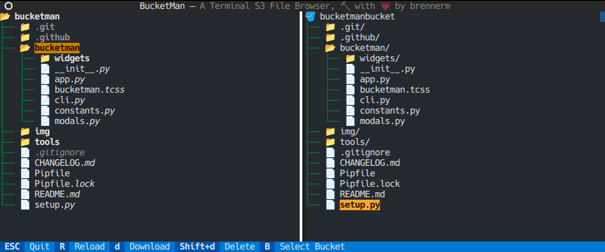

# bucketman 

A terminal application for exploring and interacting (coming soon) with S3 buckets.



## Installation

```bash
$ pip install bucketman
$ bucketman --help
```

## Authentication

bucketman uses the boto3 library for interacting with your S3 buckets. Thus it supports the same ways of [providing your credentials](https://boto3.amazonaws.com/v1/documentation/api/latest/guide/credentials.html).

Additionally you can pass your access and secret key using the `--access-key-id` and `--secret-access-key` parameters as well as providing a custom endpoint URL with `--endpoint-url` for non-AWS S3 buckets.

## Features

- browse through S3 buckets
- switch between S3 buckets
- browse through local directories
- delete S3 objects
- upload files to S3
- download files from S3

## Planned features

- copy files from one S3 bucket to another
- move/rename S3 objects
- set ACL and metadata of S3 objects
- view file content
- support S3 bucket pagination
- FileDrop support for uploading files
- safe mode disabling all destructive actions
