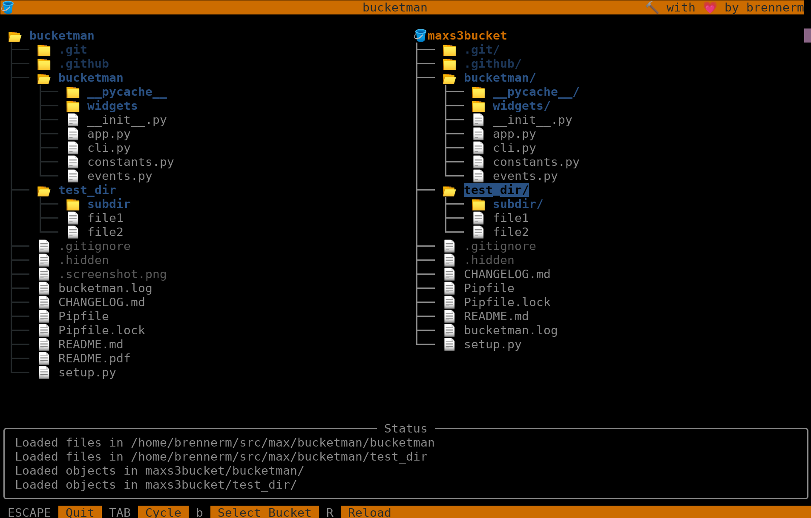

# bucketman

A terminal application for exploring and interacting (coming soon) with S3 buckets.



## installation

```pip install bucketman```

## features

- browse through S3 buckets
- switch between S3 buckets
- browse through local directories

## planned features

- copy files from local to S3 and vice versa
- copy files from one S3 bucket to another
- delete S3 objects
- move/rename S3 objects
- set ACL and metadata of S3 objects
- support S3 bucket pagination
